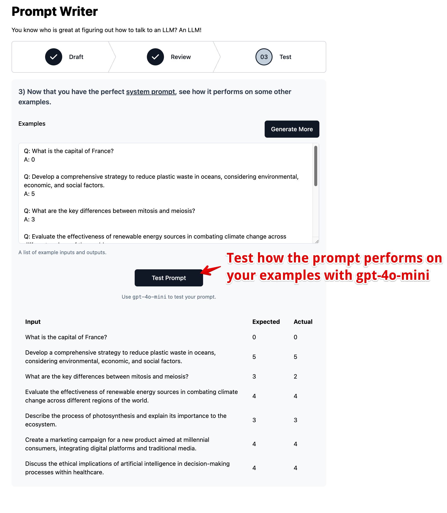

# Prompt Writer

You know who is great at figuring out how to talk to an LLM? An LLM!

This tool helps helps you write amazing prompt engineered prompts.

## App Overview

1. **Draft**: First roughly describe the task you want to accomplish.
   

2. **Review**: The AI will generate a prompt engineered system prompt for you using the latest and greatest tricks and techniques. You can edit and tweak.
   

3. **Test**: Lastly, you can test your prompt against a smaller model to see how it performs using examples that were not part of the system prompt.

   
   

## Development

Run the dev server:

```sh
npm run dev
```

To run Wrangler:

```sh
npm run build
npm run start
```

## Typegen

Generate types for your Cloudflare bindings in `wrangler.toml`:

```sh
npm run typegen
```

You will need to rerun typegen whenever you make changes to `wrangler.toml`.

## Deployment

> [!WARNING]  
> Cloudflare does _not_ use `wrangler.toml` to configure deployment bindings.
> You **MUST** [configure deployment bindings manually in the Cloudflare dashboard][bindings].

First, build your app for production:

```sh
npm run build
```

Then, deploy your app to Cloudflare Pages:

```sh
npm run deploy
```

[bindings]: https://developers.cloudflare.com/pages/functions/bindings/

## Styling

This template comes with [Tailwind CSS](https://tailwindcss.com/) already configured for a simple default starting experience. You can use whatever css framework you prefer. See the [Vite docs on css](https://vitejs.dev/guide/features.html#css) for more information.
